# FlashPrep


FlashPrep is an online flash card software that uses an adaptive feedback algorithm to increase a student's studying efficiency. 
Whenever a student gets a card incorrect, the card appears more frequently than cards the student gets correct.


## Technical Specifications:
FlashPrep's front end uses Angular 11 & Jasmine JavaScript Testing Framework. \
FlashPrep's back end uses ExpressJS, NodeJS, Jasmine JavaScript Testing Framework, & MySQL database.


## Instructions for running:
Please ensure that you have the following downloaded and configured on your machine: \
Node Package Manager (NPM)\
Angular CLI (version 11+) \
MySQL \
NodeJS


Prior to running FlashPrep locally, you will need to have MySQL database server downloaded, configured, set up, and running. See [mysql](https://www.mysql.com/) for instructions for your computer operating system. 

In flashprep-backend/config/dbConfig.js, change your password to the password you have for MySQL database.

Before connecting Node.js FlashPrep Application with MySQL, we need the tables first.
So run the SQL script below to create the tables needed for FlashPrep:

```
CREATE DATABASE IF NOT EXISTS flashprep;
USE flashprep;

CREATE TABLE `flashprep`.`user` (
  `id` INT NOT NULL AUTO_INCREMENT,
  `username` VARCHAR(64) NOT NULL,
  `email` VARCHAR(255) NOT NULL,
  `password` VARCHAR(32) NOT NULL,
  PRIMARY KEY (`id`),
  UNIQUE INDEX `username_UNIQUE` (`username` ASC) VISIBLE,
  UNIQUE INDEX `email_UNIQUE` (`email` ASC) VISIBLE);

CREATE TABLE `flashprep`.`deck` (
  `id` INT NOT NULL AUTO_INCREMENT,
  `user_id` INT NOT NULL,
  `name` VARCHAR(255) NOT NULL,
  `description` VARCHAR(1023) NULL DEFAULT NULL,
  PRIMARY KEY (`id`),
  INDEX `fk_user_id_idx` (`user_id` ASC) VISIBLE,
  CONSTRAINT `user_id`
    FOREIGN KEY (`user_id`)
    REFERENCES `flashprep`.`user` (`id`)
    ON DELETE NO ACTION
    ON UPDATE NO ACTION);

CREATE TABLE `flashprep`.`card` (
  `id` INT NOT NULL AUTO_INCREMENT,
  `deck_id` INT NOT NULL,
  `front_text` VARCHAR(2047) NULL,
  `back_text` VARCHAR(2047) NULL,
  `weight` INT NULL DEFAULT 1,
  PRIMARY KEY (`id`),
  INDEX `deck_id_idx` (`deck_id` ASC) VISIBLE,
  CONSTRAINT `deck_id`
    FOREIGN KEY (`deck_id`)
    REFERENCES `flashprep`.`deck` (`id`)
    ON DELETE CASCADE
    ON UPDATE NO ACTION);

INSERT INTO `flashprep`.`user`
(`username`,
`email`,
`password`)
VALUES
('username1',
'username1@emailservice.com',
'letmein1'
),
('username2',
'username2@emailservice.com',
'letmein2'
),
('username3',
'username3@emailservice.com',
'letmein3'
),
('username4',
'username4@emailservice.com',
'letmein4'
),
('username5',
'username5@emailservice.com',
'letmein5'
);

INSERT INTO `flashprep`.`deck`
(`user_id`,
`name`,
`description`)
VALUES
(1,
'deck1',
'first demo deck. Test data here.'),
(1,
'deck2',
'second demo deck. Test data here.'),
(2,
'deck3',
'3rd demo deck. Test data here.'),
(3,
'deck4',
'4th demo deck. Test data here.');

INSERT INTO `flashprep`.`card`
(`deck_id`,
`front_text`,
`back_text`)
VALUES
(1,
'example card 1',
'This is the first test card. For testing purposes only. This is fake data. This is fake data. This is fake data.'),
(1,
'example card 2',
'This is the second test card. For testing purposes only. This is fake data. This is fake data. This is fake data.'),
(1,
'example card 3',
'This is the third test card. For testing purposes only. This is more fake data.'),
(2,
'example card 4',
'This is the 4th test card. For testing purposes only. This is more fake data.'),
(2,
'example card 5',
'This is the 5th test card. For testing purposes only. This is more fake data.'),
(2,
'example card 6',
'This is the 6th test card. For testing purposes only. This is more fake data.');

```


To run, please note that the front end and back end run on separate ports and you will need to have MySQL Database server running. First run the back end server (see /flashprep-backend README.md for instructions). Next start the front end web application (see /flashprep-front README.md for instructions). You will need to run these commands from the root of each respective directories (so you will need to have two separate terminal sessions open).


## Contributers:
Jared Barber (Product Manager) \
Arunabh Bhattacharya (Developer) \
Neshka Dantinor (Developer) \
Gustavo Cruz-Medina (Scrum Master) 

## FlashPrep Web Application Pictures

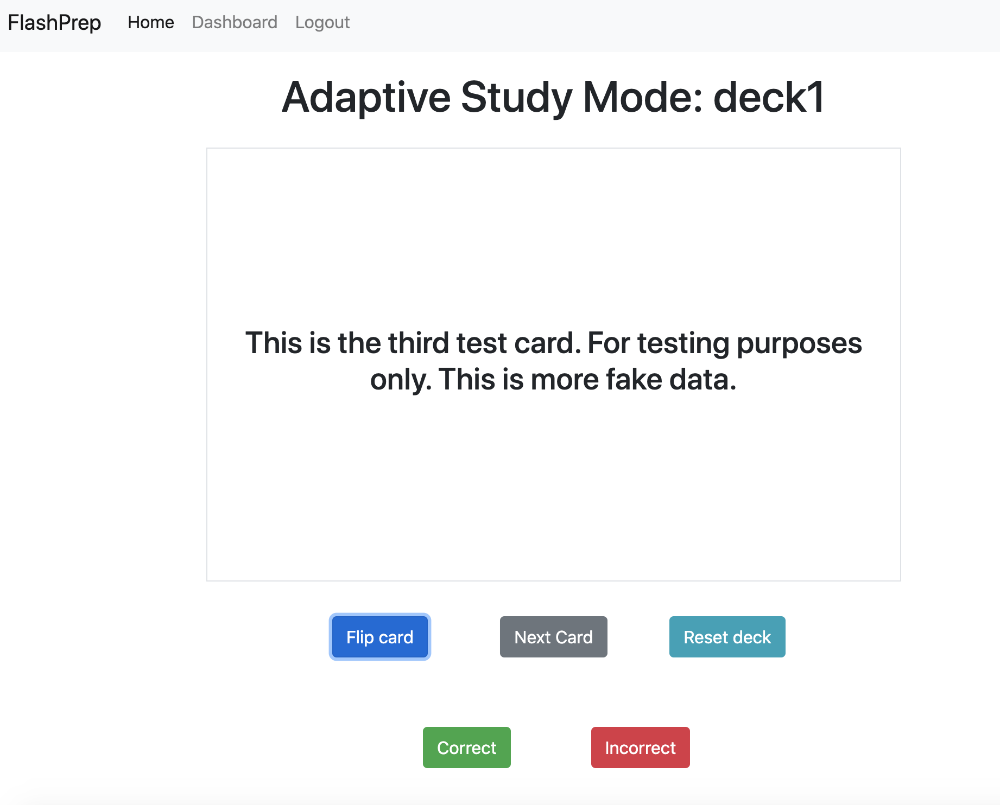
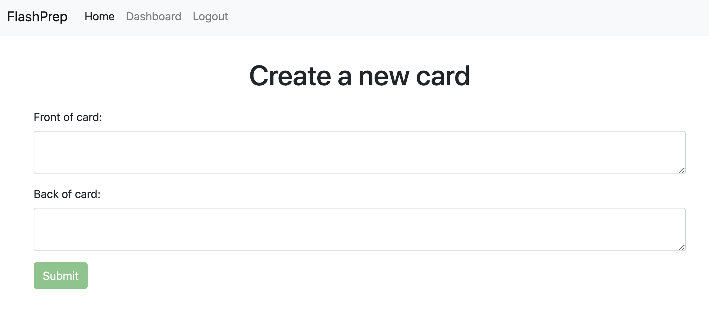
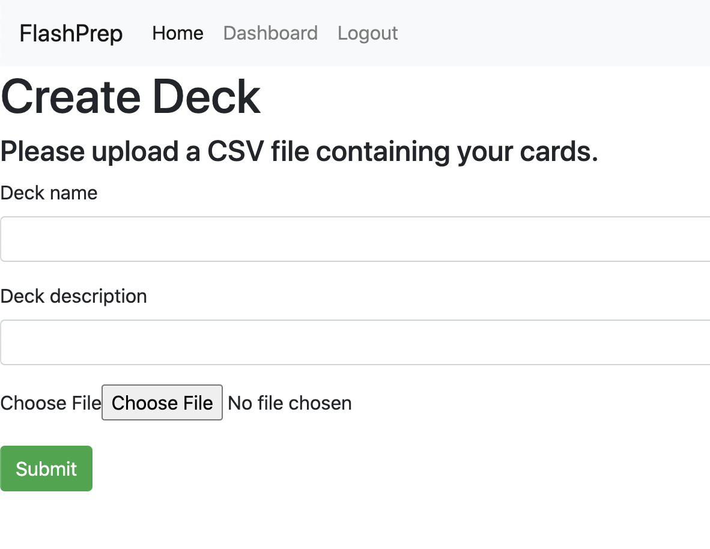
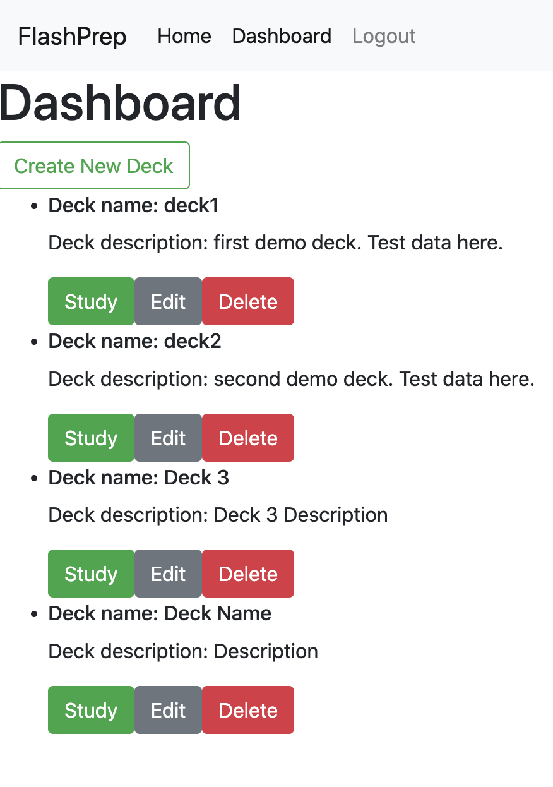

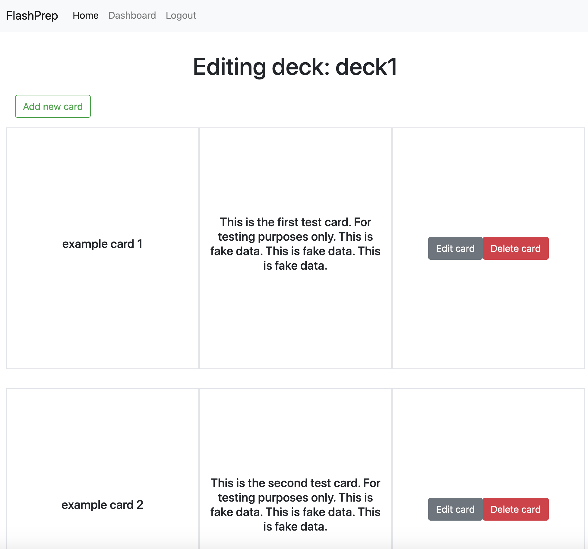
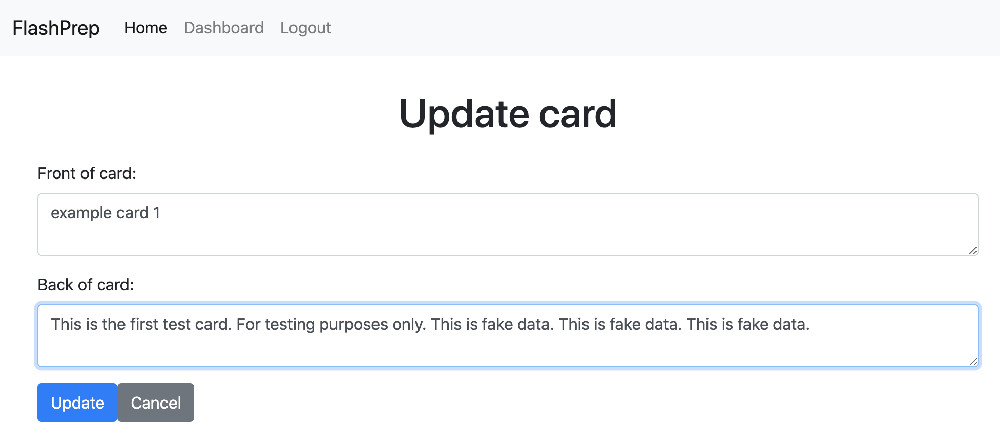
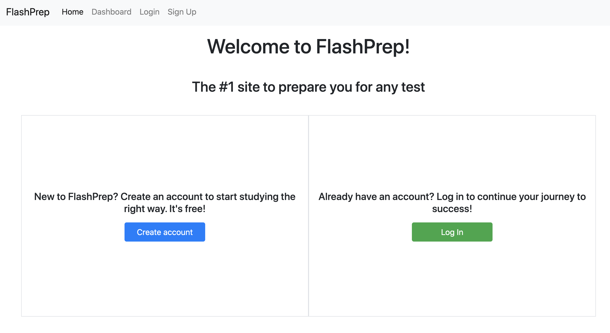
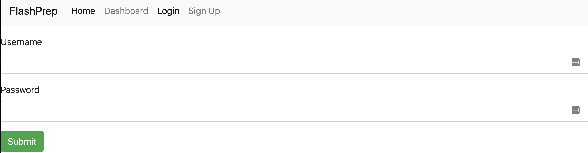
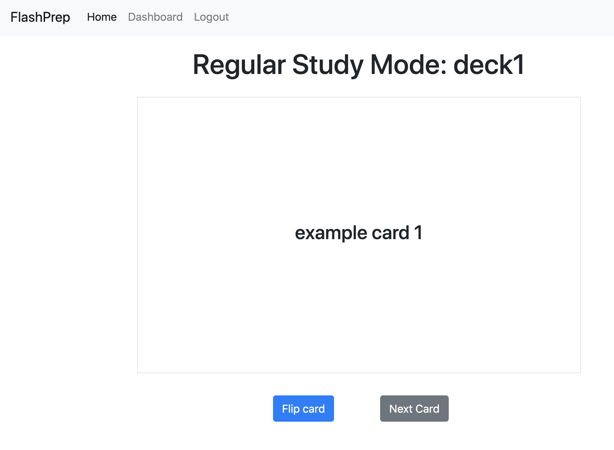
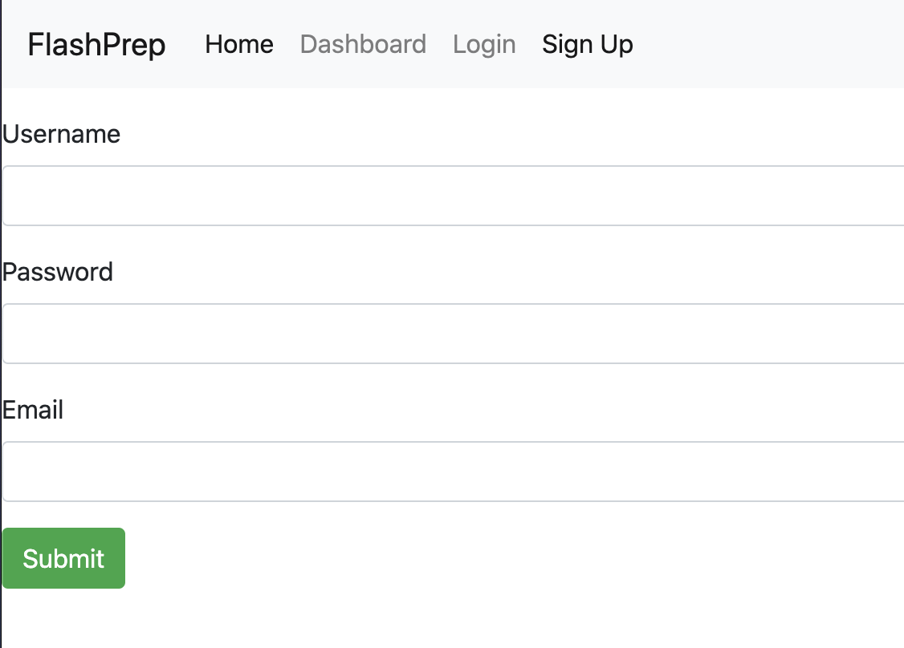
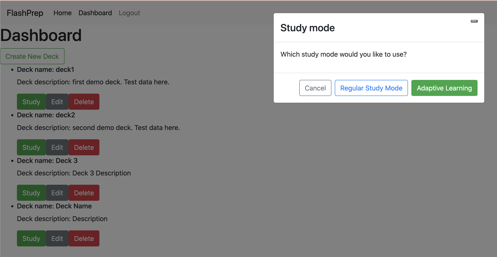


