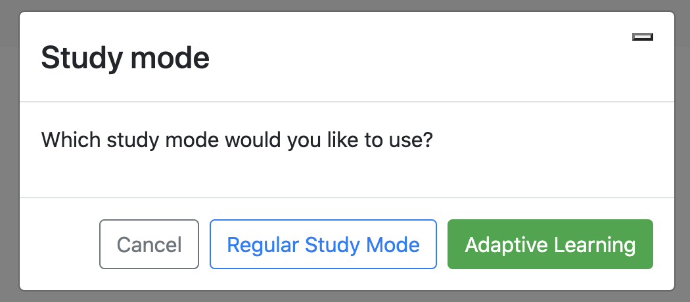

# FlashPrep

FlashPrep is a online flash card software that uses an adaptive feedback algorithm to increase a student's studying efficiency. 
Whenever a student gets a card incorrect, the card appears more frequently than cards the student gets correct.

## Technical Specifications:
FlashPrep's front end uses Angular 11 & Jasmine JavaScript Testing Framework. \
FlashPrep's back end uses ExpressJS, NodeJS, Jasmine JavaScript Testing Framework, & MySQL database.

## Instructions for running:
To run, please note that the front end and back end run on separate ports. First run the back end server (see /flashprep-backend README.md for instructions). Next start the front end web application (see /flashprep-front README.md for instructions).

Please ensure that you have the following downloaded and configured on your machine:
Node Package Manager (NPM)\
Angular CLI (version 11+) \
ExpressJS \
MySQL \
NodeJS

## Contributers:
Jared Barber (Product Manager) \
Arunabh Bhattacharya (Developer) \
Neshka Dantinor (Developer) \
Gustavo Cruz-Medina (Scrum Master) 

## FlashPrep Web Application Pictures

